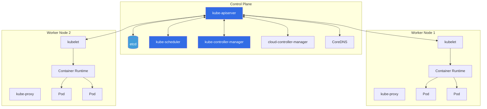
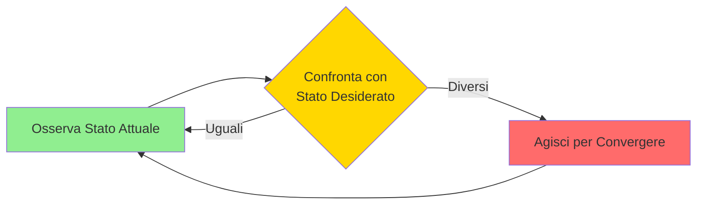
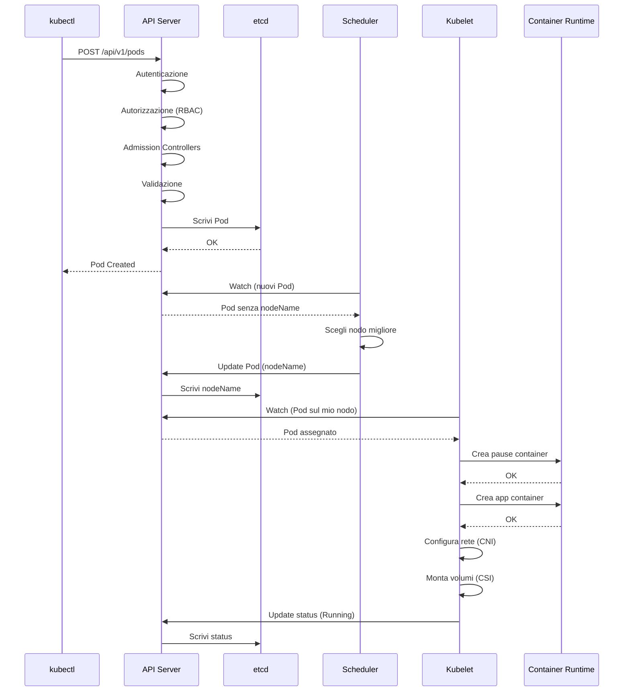

# Modulo 2: 🏛️ Architettura di Kubernetes

Comprendere come Kubernetes gestisce i carichi di lavoro e come i suoi componenti comunicano tra loro è fondamentale per ogni amministratore o sviluppatore.

## 📊 Architettura Generale



## 🧠 Il Control Plane (Il "Cervello")
Il Control Plane è responsabile di mantenere lo **stato desiderato** del cluster. È composto da diversi componenti chiave che lavorano in armonia.

### 1. kube-apiserver
L'unico punto di ingresso per tutte le operazioni sul cluster. 
- Gestisce le richieste REST da `kubectl`, dalla dashboard o da altri strumenti.
- Valida i dati e aggiorna gli oggetti in **etcd**.
- Implementa l'autenticazione (chi sei?) e l'autorizzazione (cosa puoi fare?).

### 2. etcd
Il database del cluster. 
- Archivio **chiave-valore** distribuito e coerente.
- Memorizza TUTTI i dati di configurazione e lo stato del cluster.
- **Best Practice**: In produzione, deve essere sempre in configurazione ad alta disponibilità (HA) con backup regolari.

### 3. kube-scheduler
Il "vigile" del traffico.
- Monitora i nuovi Pod che non hanno ancora un nodo assegnato.
- Sceglie il miglior nodo possibile basandosi su:
    - Requisiti di risorse (CPU/RAM).
    - Vincoli di policy (Affinity/Anti-affinity).
    - Taints e Tolerations.

### 4. kube-controller-manager
Il guardiano della stabilità.
- Esegue loop di controllo infiniti: osserva lo stato attuale, lo confronta con lo stato desiderato e agisce per correggere le discrepanze (**Reconciliation Loop**).
- Include: **Node Controller**, **Replication Controller**, **Endpoints Controller**, **ServiceAccount Controller**, e molti altri.
- Ogni controller è un processo separato, ma per semplicità sono compilati in un unico binario.

### 5. cloud-controller-manager
Il ponte verso il cloud provider.
- Separa la logica specifica del cloud provider dal core di Kubernetes.
- Gestisce: **Node Controller** (verifica se un nodo è stato eliminato nel cloud), **Route Controller** (configura le route di rete), **Service Controller** (crea load balancer cloud).
- Non presente in cluster on-premise o locali (Minikube, Kind).

### 6. CoreDNS
Il servizio DNS interno del cluster.
- Risolve i nomi dei Service in indirizzi IP (es. `my-service.default.svc.cluster.local`).
- Ogni Pod è configurato automaticamente per usare CoreDNS.
- Essenziale per la service discovery.

---

## 👷 Worker Nodes (Le "Braccia")
I nodi sono le macchine (fisiche o virtuali) dove vengono eseguiti i container delle tue applicazioni.

### 1. kubelet
L'agente che gira su ogni nodo del cluster.
- Si assicura che i container descritti nei **PodSpec** siano in esecuzione e sani.
- Non gestisce container che non sono stati creati da Kubernetes.
- Può gestire **Static Pods**: Pod definiti in file locali (in `/etc/kubernetes/manifests/`) invece che tramite API Server. Utile per i componenti del Control Plane stesso.

### 2. kube-proxy
Il gestore della rete locale al nodo.
- Mantiene le regole di rete (**iptables**, **IPVS**, o **nftables**) per permettere la comunicazione tra Pod e verso i Servizi.
- Gestisce il bilanciamento del carico semplice per i Servizi Kubernetes.
- **Modalità**:
  - **iptables** (default): Usa regole iptables per il routing.
  - **IPVS**: Più performante per cluster grandi, usa Linux Virtual Server.
  - **userspace**: Modalità legacy, raramente usata.

### 3. Container Runtime
Il software che esegue effettivamente i container.
- Kubernetes supporta runtime conformi allo standard **CRI** (Container Runtime Interface), come `containerd` or `CRI-O`.

---

## 🔌 Le Interfacce Standard (X-RI)
Kubernetes è modulare grazie a queste interfacce:
1. **CRI (Container Runtime Interface)**: Per la gestione dei container (containerd, CRI-O).
2. **CNI (Container Network Interface)**: Per la connettività di rete (Calico, Flannel, Cilium, Weave).
3. **CSI (Container Storage Interface)**: Per la gestione dei volumi persistenti (AWS EBS, GCE PD, Ceph).

**Perché le interfacce?** Permettono di sostituire componenti senza modificare il core di Kubernetes. Ad esempio, puoi passare da Flannel a Calico senza toccare kubelet.

---

## 🔐 Admission Controllers
I "guardiani" delle richieste all'API Server.
- Intercettano le richieste **dopo l'autenticazione/autorizzazione** ma **prima della persistenza in etcd**.
- Possono **validare** (rifiutare richieste non conformi) o **mutare** (modificare le richieste).
- Esempi:
  - **NamespaceLifecycle**: Impedisce la creazione di oggetti in namespace in fase di terminazione.
  - **LimitRanger**: Applica limiti di risorse di default.
  - **PodSecurityPolicy** (deprecato, sostituito da **Pod Security Admission**): Controlla le policy di sicurezza dei Pod.
  - **MutatingAdmissionWebhook** e **ValidatingAdmissionWebhook**: Permettono di creare admission controller custom.

---

## 🎯 API Groups e Versioning
Le API di Kubernetes sono organizzate in gruppi e versioni:
- **Core Group** (legacy): `/api/v1` - Pod, Service, ConfigMap, Secret
- **Named Groups**: `/apis/<group>/<version>` 
  - `apps/v1`: Deployment, StatefulSet, DaemonSet
  - `batch/v1`: Job, CronJob
  - `networking.k8s.io/v1`: Ingress, NetworkPolicy
  - `rbac.authorization.k8s.io/v1`: Role, RoleBinding

**Versioning**:
- **Alpha** (v1alpha1): Sperimentale, può cambiare o essere rimossa.
- **Beta** (v1beta1): Testata, ma può ancora cambiare.
- **Stable** (v1): Produzione-ready, retrocompatibile.

---

## 🔄 Il Pattern Reconciliation Loop
Il cuore di Kubernetes: il **control loop** (o reconciliation loop).



**Esempio**: Deployment Controller
- Stato desiderato: 3 repliche
- Stato attuale: 2 repliche
- Azione: Crea 1 nuovo Pod

Questo pattern rende Kubernetes **self-healing** e **dichiarativo**.

---

## 🏆 High Availability (HA)
In produzione, il Control Plane deve essere ridondante:
- **etcd**: Cluster con numero dispari di nodi (3, 5, 7) per il quorum.
- **API Server**: Multipli dietro un load balancer.
- **Scheduler e Controller Manager**: Multipli, ma solo uno attivo alla volta (**Leader Election**).

**Leader Election**: I componenti usano un meccanismo di lock (in etcd o tramite Lease) per eleggere un leader. Se il leader fallisce, un altro prende il suo posto.

---

## 🧩 Addons Comuni
Componenti opzionali ma molto usati:
- **CoreDNS**: DNS interno (già menzionato).
- **Metrics Server**: Raccoglie metriche di CPU/RAM per `kubectl top` e HPA.
- **Dashboard**: UI web per gestire il cluster.
- **Ingress Controller**: Gestisce l'accesso HTTP/HTTPS dall'esterno (nginx, Traefik, HAProxy).
- **CNI Plugin**: Networking (Calico, Flannel, Cilium).

---

## 🏷️ Concetti di Base degli Oggetti
Ogni risorsa in Kube ha dei metadati fondamentali:
- **Namespaces**: Isolamento logico all'interno dello stesso cluster (es. `dev`, `prod`, `kube-system`). Alcuni oggetti sono cluster-scoped (Node, PersistentVolume, Namespace stesso).
- **Labels (Etichette)**: Coppie chiave-valore usate per raggruppare e selezionare oggetti (fondamentali per i Services). Esempio: `app=nginx`, `env=prod`.
- **Selectors**: Query per filtrare oggetti tramite label (es. `app=nginx,env=prod`).
- **Annotations (Annotazioni)**: Usate per memorizzare metadati non identificativi (es. info di build, timestamp, config per strumenti esterni). Non usate per selezione.

**Best Practice Labels**:
```yaml
metadata:
  labels:
    app.kubernetes.io/name: nginx
    app.kubernetes.io/instance: nginx-prod
    app.kubernetes.io/version: "1.21"
    app.kubernetes.io/component: webserver
    app.kubernetes.io/part-of: ecommerce
    app.kubernetes.io/managed-by: helm
```

---

## 🔒 RBAC (Role-Based Access Control)
Il sistema di autorizzazione di Kubernetes:
- **ServiceAccount**: Identità per i Pod (usata dai processi dentro i container).
- **User**: Identità per utenti umani (gestita esternamente, es. certificati, OIDC).
- **Role/ClusterRole**: Definisce permessi (verbi: get, list, create, delete su risorse).
- **RoleBinding/ClusterRoleBinding**: Associa Role a User/ServiceAccount.

**Differenza**:
- **Role/RoleBinding**: Namespace-scoped.
- **ClusterRole/ClusterRoleBinding**: Cluster-scoped.

---

## 🛠️ Esercizi Pratici con Kubectl

Prova questi comandi sul tuo cluster (es. creato con Minikube o Kind):

```bash
# Verifica lo stato dei componenti del control plane (deprecato in alcune versioni, ma utile)
kubectl get componentstatuses

# Visualizza i nodi con etichette extra
kubectl get nodes --show-labels

# Ispeziona i dettagli di un nodo specifico
kubectl describe node <nome-nodo>

# Elenca tutte le API disponibili nel cluster
kubectl api-versions

# Visualizza tutte le risorse API disponibili
kubectl api-resources

# Visualizza i Pod del Control Plane (se usi kubeadm)
kubectl get pods -n kube-system

# Verifica i componenti CoreDNS
kubectl get pods -n kube-system -l k8s-app=kube-dns

# Visualizza gli Admission Controllers abilitati
kubectl exec -n kube-system kube-apiserver-<node> -- kube-apiserver -h | grep enable-admission-plugins

# Visualizza le API groups
kubectl api-resources --api-group=apps

# Verifica il leader del controller-manager (se HA)
kubectl get lease -n kube-system kube-controller-manager -o yaml

# Visualizza i ServiceAccount di default
kubectl get serviceaccounts --all-namespaces

# Verifica le ClusterRole predefinite
kubectl get clusterroles | head -20
```

---

## 💡 Approfondimento: Il giro di un Pod
Cosa succede quando dai `kubectl apply -f pod.yaml`?



**Nota**: Tutti i componenti usano il pattern **watch** (long-polling) per essere notificati dei cambiamenti in tempo reale, invece di fare polling continuo.
