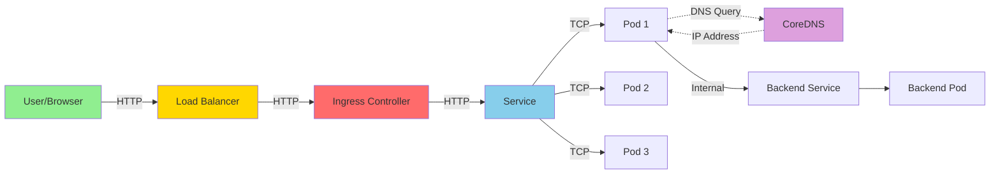
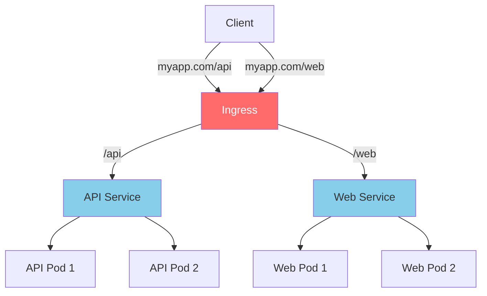
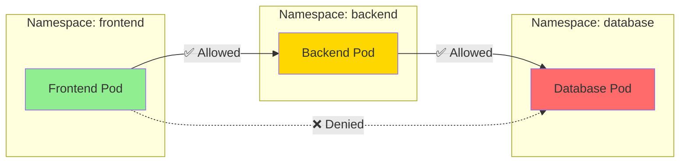

# Modulo 4: 🌐 Networking in Kubernetes

Il networking in Kubernetes si basa sul principio che ogni Pod ha il suo indirizzo IP unico e può comunicare con gli altri Pod nel cluster senza NAT. Questo modulo approfondisce come gestire il traffico interno ed esterno.

## 📊 Flusso di Rete Completo



---

## 1. Service Discovery & DNS
Kubernetes ha un servizio DNS interno (solitamente **CoreDNS**) che permette ai Pod di trovarsi a vicenda usando nomi logici invece di indirizzi IP effimeri.
- **FQDN (Full Qualified Domain Name)**: Un servizio chiamato `my-svc` nel namespace `dev` è raggiungibile all'indirizzo `my-svc.dev.svc.cluster.local`.
- **Short Name**: Se i Pod sono nello stesso namespace, possono trovarsi semplicemente usando `my-svc`.

---

## 2. Ingress: Il Gateway Intelligente
Mentre un `Service` di tipo `LoadBalancer` espone un solo servizio, un **Ingress** gestisce il traffico HTTP/S per più servizi usando un unico punto di ingresso.



- **Ingress Controller**: Il software che implementa le regole (es. Nginx, Traefik, HAProxy, Istio).
- **Regole di Routing**:
    - **Host-based**: `app1.com` va al servizio A, `app2.com` va al servizio B.
    - **Path-based**: `/api` va al backend, `/` va al frontend.

```yaml
apiVersion: networking.k8s.io/v1
kind: Ingress
metadata:
  name: main-ingress
spec:
  rules:
  - host: myapp.local
    http:
      paths:
      - path: /api
        pathType: Prefix
        backend:
          service:
            name: api-service
            port:
              number: 8080
```

---

## 3. Network Policies: Il Firewall Nativo
Di default, la rete di Kubernetes è "aperta" (ogni Pod parla con ogni Pod). In produzione, devi isolare i carichi di lavoro.



- **Ingress Policy**: Regole per il traffico in entrata.
- **Egress Policy**: Regole per il traffico in uscita.
- **Selectors**: Puoi filtrare per label di Pod, label di Namespace o blocchi IP (CIDR).

**Esempio**: Permetti solo al frontend di parlare con il database.
```yaml
spec:
  podSelector:
    matchLabels:
      app: database
  ingress:
  - from:
    - podSelector:
        matchLabels:
          app: frontend
```

---

## 4. Endpoints & EndpointSlices
Come fa un Service a sapere quali Pod sono pronti a ricevere traffico?
- **Endpoints**: Una risorsa automatica che elenca gli IP dei Pod che superano il `Readiness Probe`.
- **EndpointSlice**: Una versione più scalabile introdotta per cluster con migliaia di Pod.

---

## 5. CNI (Container Network Interface)
L'implementazione fisica della rete è gestita dai plugin CNI:
- **Calico**: Ottimo per le Network Policies (usa BGP).
- **Flannel**: Semplice, usa VXLAN per incapsulare i pacchetti.
- **Cilium**: Moderno, usa **eBPF** nel kernel Linux per prestazioni elevatissime e sicurezza senza l'uso di iptables.

---

## 🛠️ Debugging del Networking

Se un Pod non riesce a raggiungere un servizio, prova questi passaggi:
1. **Verifica il Service**: `kubectl get svc`.
2. **Verifica gli Endpoints**: `kubectl get endpoints <service-name>`. Se la lista è vuota, il selettore del Service non trova i Pod o i Pod hanno fallito i probe.
3. **Test DNS**: `kubectl exec -it <pod-name> -- nslookup <service-name>`.
4. **Test Connettività**: `kubectl exec -it <pod-name> -- curl -v <service-ip>:<port>`.

---

## 🎯 Esercizio Pratico
1. Crea un Ingress che instradi il traffico verso due diversi servizi basandosi sul path (`/v1` e `/v2`).
2. Applica una Network Policy che blocchi tutto il traffico in uscita (egress) da un Pod, tranne quello verso il DNS del cluster.
3. Ispeziona gli Endpoints di un servizio esistente e nota come cambiano quando scali il deployment.
